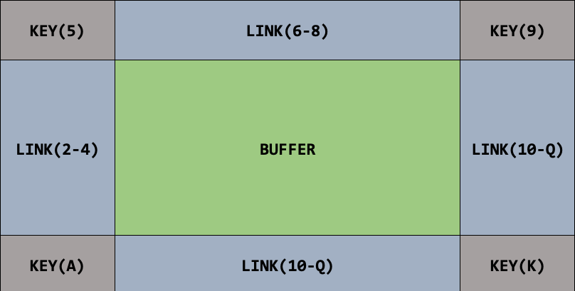
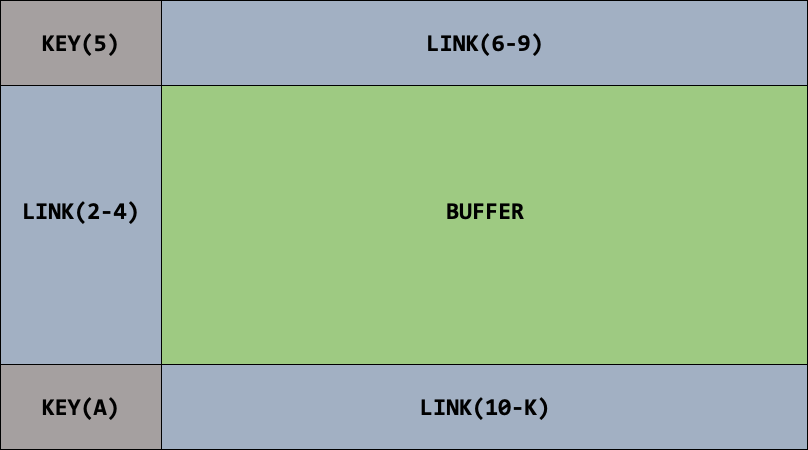
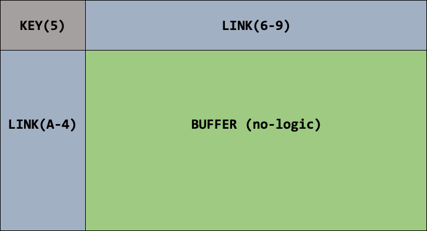

# CS4725: <em>Poker Squares Final Project Report<em> (Arbeau, D., Higgins, G., White, S., 2019)

## Grid Model

With the British Scoring System, we realize flushes do not reward many points; so, adopting FlushPlayer would not be a good approach. After considering our different options, we decided to focus on getting straights. They are relatively easy to obtain, while also rewarding a decent amount of points. It would be ambitious to try for straights in every row and column as many different spaces would be competing for certain cards - leading to a lower final score on average. Focusing on straights in the outermost columns and rows gave us a higher score overall. The idea was to aim for ace through five on the left column, five through nine on the top row, nine through king on the right, and ten through ace on the bottom.

## Horseshoe Model

One problem that quickly became evident was that the right column and the bottom row were both competing for the cards: ten, jack, and queen. With some testing we noticed that we rarely achieve all four straights. Our solution to this problem was to try dropping the right column and only going for straights in the left, top and bottom. We coined this approach “the horseshoe model.” This would allow for the right column to be added to the buffer area, making it a size of three rows and four columns. This approach still led to a rather disappointing score since we filled the buffer area randomly.

As for which hands to aim for in the buffer, we decided to focus on three of a kind, four of a kind, and full houses. The reason we decided to go for those hands in particular is that four of a kind and full house are both worth a good amount of points, while three of a kind is a respectable fall back in case the other two are not possible. Flushes are not worth enough points and are difficult to complete. Aiming for flushes would require restricting the suits of the border. Attempting to complete flushes in the buffer would only decrease the odds of achieving all the straights in our horseshoe; therefore, resulting in a lower final score on average. Aiming for straights in the buffer is also a waste of points as there is no easy fall back strategy involving them.

For the logic of the buffer, we calculate which spot would cause the least amount of damage and place the card in that cell. In other words, we try to find the spot in the buffer that minimizes the potential point loss. A simple example would be to imagine a column that currently has two cards of rank six and two cards of rank ten. The ideal card to place in this row is either a six or a ten. If we draw a seven, we will not place it in this column if there are other spots available. In order to calculate the spot that causes the least amount of damage, a minimax function is in place that calculates the probability of achieving a three of a kind, a four of a kind, and a full house. Each column has a value assigned to it after this calculation; the column with the lowest value receiving the card.

Logically, the approach works well as we choose hands to go for that minimizes the risk towards other rows and columns. As mentioned earlier, by going for four of a kind in the columns we can indirectly get three of a kind if the fourth card is never drawn. By going for three and four of a kind in each column, we are also indirectly going for full house. The probabilities of getting each type compared to the risk of not getting them yields great value, which is why we chose to focus on them over others.

Our approach is quite successful, as the score we achieve on average is around forty-seven; which is consistently better than the examples provided. Another important detail to note is that our approach runs extremely fast while still achieving a good score. Our agent can run one million simulations in approximately ten seconds. The efficiency alone makes the score that we achieve even more impressive, since time is always a big factor when it comes to Artificial Intelligence problems.

Given more time, there are some improvements that we would have attempted to implement. The first change would be to add logic for the rows, since we only aim for points in the columns; except for the top and bottom row. To add this logic would have been challenging, time consuming, and ultimately not worth the extra couple of points we may have gotten; hence why we chose to not implement it for this project.
Another change that we could make in order to achieve a higher score would be to prioritize straight flushes on the outside border rather than normal straights. We discussed this approach as we were implementing our agent but agreed that it would be overly complicated to set a limit on how long it should try to go for the straight flush before going for a normal straight. The amount of points lost on average compared to the amount of points gained would take a lot of testing and analyzing, which we simply did not have enough time to do.
Additionally, we would have liked to explore additional variations on our model. Additional variations that we had in mind included only have two connected sides, which we named “the L-Model." [Figure 1.2] However, we did not end up testing out the L-Model due to a lack of time. Additionally, it would have been interesting to test out a single row along the top with nothing else, and no “hardcoded” rows/columns at all, to see how the score may differ. Once again, these were not explored due to lack of time.

## L Model

Finally, we briefly discussed calculating the odds of achieving each type of hand in every space, given the current card. For example, if we draw a card of rank three, we would iterate through each spot in the grid and calculate which square had the highest expected value if a three were placed in that cell. We decided not to attempt this strategy for two reasons. We were worried it would be extremely complicated to implement, and we were also worried that it would not run nearly fast enough for the requirements of the project. If the project allowed more time per game, we would have liked to attempt that approach and see if it is more effective than what we currently have.

## Conclusions

Overall, we believed we were successful in our implementation of this agent, which we named “smortBoi.” In our opinion, our implementation is unique and works very well, as well as being extremely efficient, as mentioned above. We are very pleased with our agent’s average score, and believe it is very respectable.

# Project outcomes

SmortBoi ended up getting 4th place in our CS4725 class amongst 16 graduate/undergraduate teams. In the opening 200 games of the tournament smortBoi had the best score (or ties for the best score) in 45 games, the next closest agent had 29.

# Usage

To see smortBoi live run `java dhiggins_smortBoiPlayer` in /bin in the console or see example.txt for what a run would look like.
